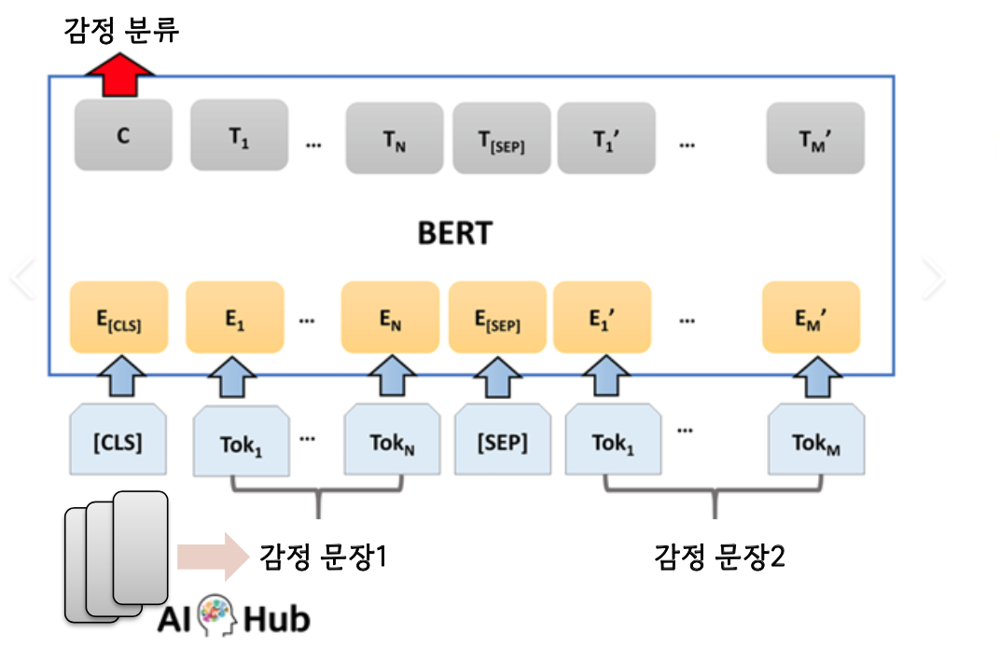
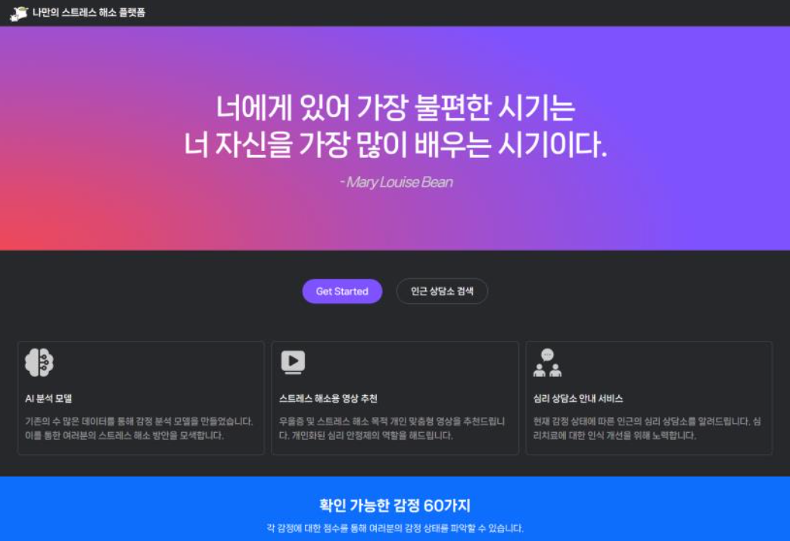
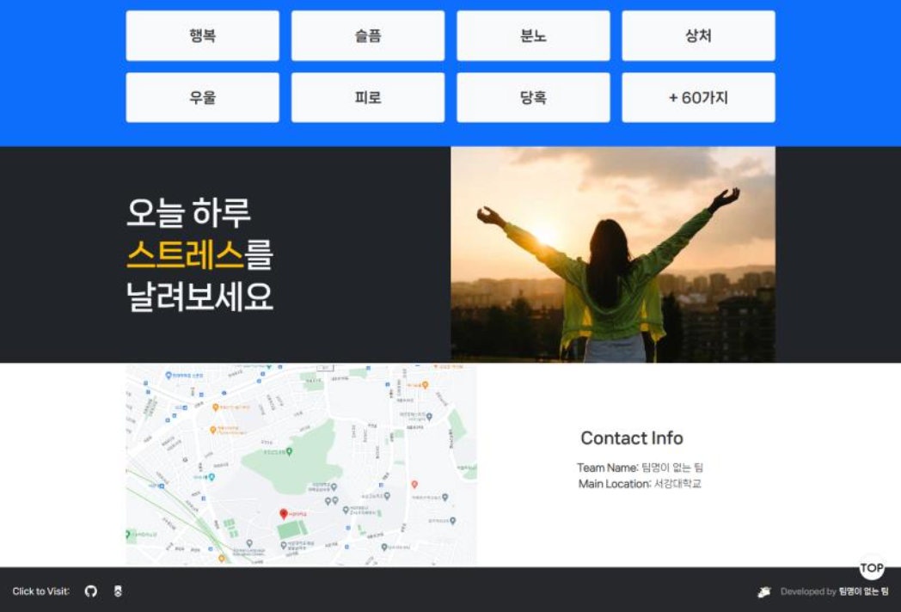
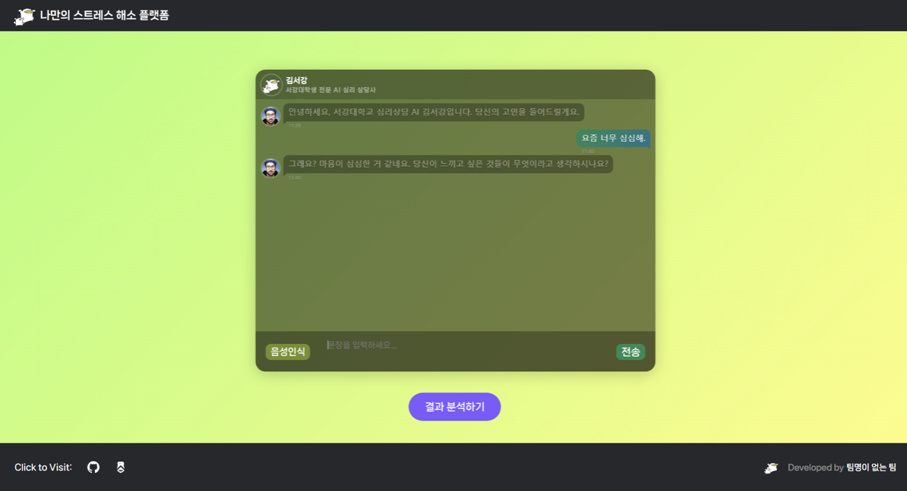
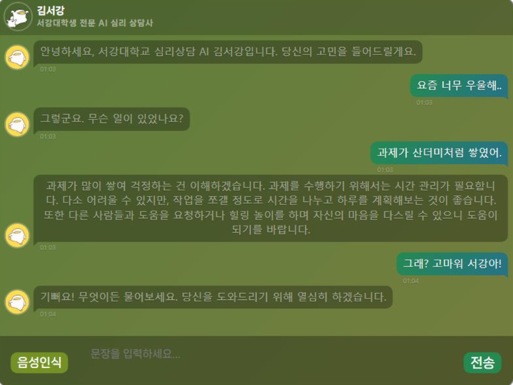
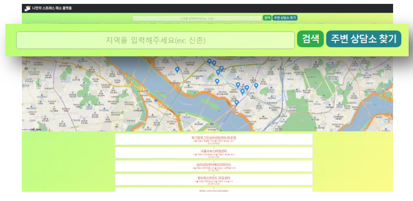

나만의 스트레스 해소 플랫폼
-----
#### 💻 사용한 스택 💻

      


-----
## 프로젝트 설명

* 한국인들은 평상시 지나친 스트레스를 안고 살고 있다.
* 별다른 스트레스 해소방법 없이 스트레스를 쌓으며 살면, 우울증을 앓기도 한다.
* GPT-3을 이용한 챗봇으로 사용자의 감정을 분석하고, 이에따라 영상을 추천해준다.
* 우을증 정도가 심한 경우, 심리상담소 정보를 제공해준다.
* 감정 분석 모델은 BERT 딥러닝 모델 사용, Flask API 서버 구축


* 감정은 총 크게 6가지로 분류
    * 기쁨
    * 슬픔
    * 불안
    * 당황
    * 상처
    * 우울
* 각 감정에 대한 예측을 0~1 지표로 활용하여 유튜브 API에서 활용
* Training Dataset에 대해서는 대략 70%의 Accuracy 달성
* EDA를 통해 본 프로젝트의 주요 키워드인 '상처' 혹은 '우울'에는 상당한 Accuracy 달성(80% 이상)
* '우울' 증세가 심하다고 여겨지는 경우(90% 이상 지표인 경우) 인근 심리상담소 정보 제공
 
-----
## 프로젝트 사용방법

__npm init__

__npm i express cors mongoose morgan dotenv__

__yarn add -D express typescript ts-node nodemon @types/node @types/express ts-node-dev__

__npx tsc --init__


### Modifying package.json 

```
    "scripts": {
		"build": "tsc",
		"dev": "ts-node-dev src/index.ts"
	}
```
    ### ts-node: equivalent with node file.js when compiling with file.ts
    ### ts-node-dev: equivalent with nodemon --exec ts-node file.ts

### Modifying tsconfig.json

```
    {
     "target": "es6",                                
     "outDir": "./dist",                              
     "rootDir": "./src",  
    } 

```

### Build Frontend Pages and Start the Server
```
    cd frontend
    npm run build
    cd ..
    cd backend
    npm run dev
```
## 주요 페이지 설명
* ##### 메인페이지




* ##### 챗봇 상담 페이지



* ##### 추천 영상 페이지


* ##### 싱담소 정보 페이지


### 프로젝트 기여자
* [kiwoongyoon](https://github.com/kiwoongyoon)
* [easter423](https://github.com/easter423)
* [brudenell](https://github.com/brudenell)


